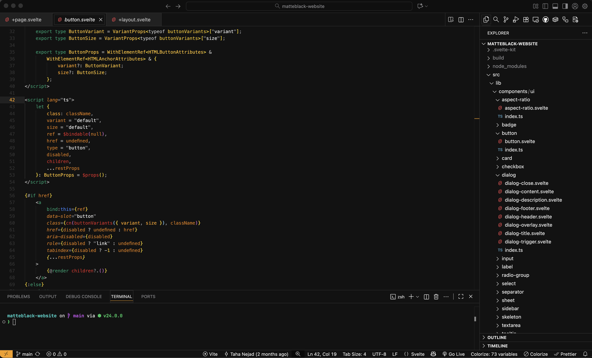

  
  <h1>Matte Black Theme</h1>
  
A low distraction dark theme for VSCode.

## Installation

[Matte Black on VSCode Marketplace](https://marketplace.visualstudio.com/items?itemName=TahaYVR.matteblack)

### Matte Black for Other Platforms

[matteblacktheme.com](https://matteblacktheme.com)

## License

MIT
